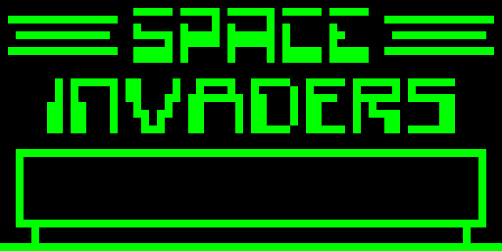
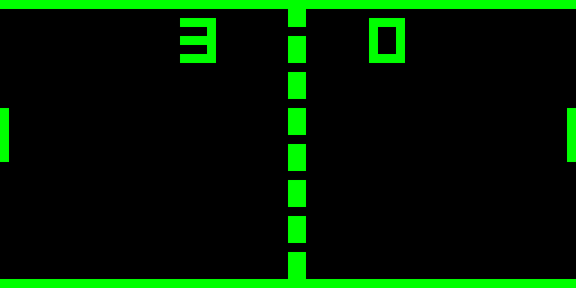

# Chippy

## Showcase
### Space Invaders

### Pong

### Breakout


## Build instructions
### Linux (GCC/Clang)
- install SDL2 (https://www.libsdl.org/download-2.0.php)

- run `make` in the root directory of the project

<!--
#### SuperCHIP

### Windows (MSVC/CL.EXE)
#### Standard build
#### SuperCHIP
-->
## Usage
### loading a game
`./chippy <path to chip8 rom>`
### playing a game
the chip8 has a 16-key keypad labelled
with hexadecimal numbers 0-F:
```
|1|2|3|C|
|4|5|6|D|
|7|8|9|E|
|A|0|B|F|
```
these are mapped to a modern keyboard layouts in the following way:
```
keyboard -> chip8

1 -> 1
2 -> 2
3 -> 3
4 -> C
Q -> 4
W -> 5
E -> 6
R -> D
A -> 7
S -> 8
D -> 9
F -> E
Z -> A
X -> 0
C -> B
V -> F
```
see roms/chip8.txt for details on each game, controls etc.
### configuring the emulator
at the moment there are only two aspects of the emulator which
can be modified: the dimensions of the window it runs in and it's
clock speed. Both of these are defined as constants in chippy.h,
please note that any value for `CLOCK_SPEED` above 1000 will make the
emulator run as fast as possible and that values for `WINDOW_HEIGHT`
and `WINDOW_WIDTH` must be multiples of 32 and 64, respectively.

## Uninstalling
- run `make clean` in the root directory of the project

# Acknowledgements
[Cowgod's CHIP8 technical reference](http://devernay.free.fr/hacks/chip8/C8TECH10.HTM)

[Wikipedia CHIP8 article](https://en.wikipedia.org/wiki/CHIP-8)

[SDL2](https://www.libsdl.org/)
